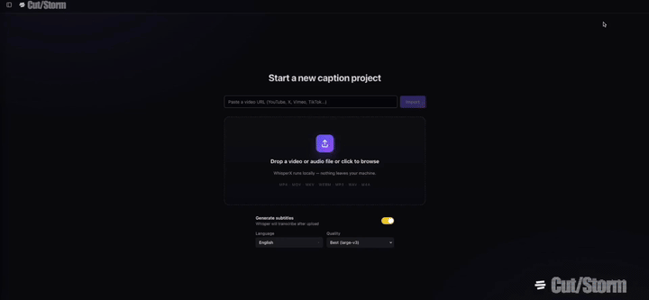

<p align="center">
  <picture>
    <source media="(prefers-color-scheme: dark)" srcset="design-assets/lockup-dark-transparent-960.png">
    
  </picture>
</p>

Self-hosted video editor for quickly turning a raw video into a finished clip with subtitles. Runs as a single Docker container.

<!-- HERO DEMO: short GIF showing URL paste -> edit -> export -->
<p align="center">
  
</p>

<p align="center">
  <a href="https://youtu.be/Qyn7CWC3Nvo">▶ Watch demo</a>
</p>

## About

Cut/Storm is a browser-based video editor focused on short-video workflows. You can drop a video file or paste a URL, trim the clip, change the aspect ratio or crop it, mix in an additional audio track, auto-remove silences, and export a finished MP4. Built into the same pipeline is Whisper-based automatic subtitling with a visual editor for the transcript and caption styles; when you export, ffmpeg burns the subtitles into the video.

Everything — URL download, Whisper transcription, subtitle rendering, ffmpeg encoding — runs inside one Docker container on the host machine. No external APIs are called, no account is required, source material never leaves the machine. All project files live under `./data/` and persist across container rebuilds.

## What you can do with Cut/Storm:

- [x] **Import a video**
    - [x] Drop a file (MP4, MOV, MKV, WebM, AVI, MP3, WAV, M4A, OGG, FLAC, AAC)
    - [x] Paste a URL (YouTube, X/Twitter, Vimeo, TikTok and anything else yt-dlp supports)
    - [x] Re-upload same file, skip re-processing (content-hash cache)
    - [x] Re-import same URL, skip re-download
    - [ ] Batch URL import
    - [ ] Cookies for age-gated / private content
- [x] **Transcribe locally**
    - [x] Whisper + WhisperX with word-level alignment
    - [x] Pick model per-upload (tiny / small / large-v3)
    - [x] Pick language or auto-detect (99+ languages)
    - [x] Segments stream live into the UI as Whisper emits them
    - [x] Survives a page reload mid-transcribe
    - [x] CPU by default, CUDA supported
    - [ ] Speaker diarization
- [x] **Edit the transcript**
    - [x] Inline edit text and timestamps
    - [x] Split segment at playhead
    - [x] Delete segment at playhead
    - [x] Undo / redo
- [x] **Style the captions**
    - [x] Font family, size, bold, italic
    - [x] Text colour, outline, shadow, background box
    - [x] Per-segment fade in / out
    - [x] Display modes: whole phrase, word-by-word, karaoke highlight
    - [x] Drag to reposition, resize by corners
    - [x] Preview is pixel-identical to the export (Chromium render)
- [x] **Edit the video**
    - [x] Aspect presets (source, 9:16, 16:9, 1:1, 4:5)
    - [x] Custom crop with anchor points
    - [x] Trim in / out with timeline handles
    - [x] Auto-remove silences (threshold + padding)
    - [x] Mix an extra audio track (voiceover / music) with per-track volume
- [x] **Export**
    - [x] MP4 with burned-in subtitles via ffmpeg
    - [x] GIF export with Low / Medium / High quality presets
    - [x] Live progress over WebSocket
    - [ ] SRT / VTT sidecar download
    - [ ] WebM / ProRes targets
- [x] **Runs anywhere**
    - [x] Single Docker container, one port
    - [x] Linux, macOS, Windows — anywhere Docker runs
    - [x] No account, no cloud, no telemetry
    - [x] Data volume-mounted, survives container rebuilds

Not in scope: AI clip picking, multi-user collaboration, AI avatars or dubbing, multi-track timeline editing. For those, use Submagic / OpusClip (the first) or Kdenlive / DaVinci Resolve (the last).

## Install

You need [Docker](https://docs.docker.com/get-docker/). Nothing else.

```bash
git clone https://github.com/vorniches/cutstorm.git
cd cutstorm
docker compose up --build
```

Open <http://localhost:8000>.

If you don't want to use git, [download the latest release as a ZIP](https://github.com/vorniches/cutstorm/releases/latest), unzip, open a terminal in that folder, run the same command.

The first build takes 10-20 minutes — it installs ffmpeg, fonts, Playwright Chromium, the Python stack and the frontend. After that, starts take under a minute. Whisper models download on first use and get cached in `./data/models/`.

## Configuration

Environment variables (see `docker-compose.yml`):

| Variable              | Default      | Meaning                                                         |
| --------------------- | ------------ | --------------------------------------------------------------- |
| `WHISPER_MODEL`       | `tiny`       | Default model. Overridden per-upload from the UI.               |
| `WHISPER_COMPUTE`     | `int8`       | CTranslate2 compute type (`int8`, `int8_float16`, `float16`).   |
| `WHISPER_DEVICE`      | `cpu`        | `cpu` or `cuda`. CUDA needs nvidia-container-toolkit on host.   |
| `WHISPERX_SKIP_ALIGN` | `0`          | `1` skips wav2vec2 alignment (faster, coarser word timing).     |
| `MAX_FETCH_SEC`       | `900`        | Max duration for URL import. Longer → 413.                       |
| `MAX_UPLOAD_BYTES`    | `2147483648` | Max upload size (2 GB default).                                 |

Data layout:

```
./data/
├── uploads/    # source videos + per-video meta.json
├── outputs/    # rendered MP4s + .ass files
└── models/     # cached Whisper + wav2vec2 weights
```

All three are volume-mounted and persist across container rebuilds.

## Architecture

One container, two parts:
- FastAPI backend in `backend/app/` — upload, yt-dlp, Whisper, ffmpeg, WebSocket progress
- React + Vite frontend in `frontend/src/` — Zustand state, live preview, drag/resize UI

Subtitle rendering goes through headless Chromium: each frame's overlay is rendered by Playwright, ffmpeg composites it onto the source video. The preview and the export use the same renderer, so what you see in the browser is what you get in the MP4.

Progress flows over `/ws/progress/{job_id}`. Long operations (download, transcribe, encode) push `{phase, percent}` messages; the frontend drives the progress bar from them. Transcription state is persisted to `meta.json` incrementally, so a page reload mid-run can reconnect to the same job and catch up on any missed segments.

## FAQ

**How is this different from CapCut / Submagic / OpusClip?**
They're cloud SaaS — faster to set up and more polished, but your footage goes to their servers and you pay a monthly subscription for any real use. Cut/Storm runs locally, has no account, and costs nothing beyond electricity.

**How is this different from Kdenlive / DaVinci Resolve?**
Those are full NLEs with timelines, layers, keyframes, and colour grading. Cut/Storm has one video, one caption track, and one export. If you need multi-track editing, use an NLE.

**Does Whisper really run on my machine?**
Yes. Models download from Hugging Face on first use and live in `./data/models/`. After that you can run without internet access.

**How accurate is transcription?**
`large-v3` with WhisperX alignment is within noise of commercial transcription services for most languages. `tiny` is rough but 20× faster — useful for scaffolding during editing.

**Why does the first build take so long?**
It pulls the base image, installs ffmpeg, downloads Playwright's Chromium (~200 MB), installs faster-whisper + WhisperX, and builds the frontend. Around 2 GB of layers when totalled. Subsequent builds only rebuild changed layers.

**Can I run this on GPU?**
Yes. Set `WHISPER_DEVICE=cuda` in `docker-compose.yml` and run `docker compose --gpus all up`. You need [nvidia-container-toolkit](https://docs.nvidia.com/datacenter/cloud-native/container-toolkit/) on the host.

**Can I expose this on my LAN / internet?**
You can, but there's no auth built in. Put a reverse proxy (Caddy, Traefik) with basic auth in front. Also add a rate limit on `/api/fetch-url` so randos can't use your machine as a free downloader.

## Contributing

Issues and PRs welcome. Open an issue first for non-trivial changes.

Backend tests:
```bash
docker exec -w /app cutstorm-app-1 pytest tests/ -v
```

Frontend E2E (requires the app running on localhost:8000):
```bash
cd frontend && npx playwright test
```

## License

MIT. For personal editing; respect each platform's Terms of Service when importing from a URL.

## Credits

- [OpenAI Whisper](https://github.com/openai/whisper) / [faster-whisper](https://github.com/SYSTRAN/faster-whisper) / [WhisperX](https://github.com/m-bain/whisperX) — transcription
- [yt-dlp](https://github.com/yt-dlp/yt-dlp) — URL import
- [ffmpeg](https://ffmpeg.org) — video processing
- [Playwright](https://playwright.dev) — subtitle rendering
